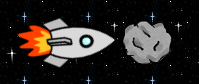
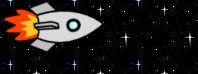

= Steckbriefe der Methoden *isTouching() / removeTouching()*

== Lernziel

Kollisionen erkennen und darauf reagieren (`isTouching`, `removeTouching`).

== Aus welcher Klasse stammt die Methode?

`Actor`

== Was macht die Methode?

* `isTouching(Class cls)` prüft, ob dieser Actor ein Objekt der angegebenen Klasse berührt.
* `removeTouching(Class cls)` entfernt ein berührtes Objekt der angegebenen Klasse aus der Welt.

== Wie sieht der Bauplan der Methode aus?

[source,java]
----
protected boolean isTouching(Class cls)
protected void removeTouching(Class cls)
----

== Was bedeuten die einzelnen Wörter?

[cols="1,4",options="header"]
|===
|Begriff |Bedeutung

|`protected`
|Regelt, wer die Methode verwenden darf (sichtbar in der Klasse und in Unterklassen).

|`boolean`
|Rückgabetyp von `isTouching`: `true` oder `false`.

|`void`
|Rückgabetyp von `removeTouching`: Die Methode führt eine Aktion aus und gibt nichts zurück.

|`isTouching`
|Name der Methode zur Kollisionsabfrage.

|`removeTouching`
|Name der Methode zum Entfernen eines berührten Objekts.

|`Class`
|Als Parameter wird eine Klasse erwartet, z. B. `Asteroid.class`.

|`cls`
|Name des Parameters mit der gesuchten Klasse.
|===

Im folgenden Beispiel soll ausnahmsweise (und der Einfachheit halber)
bei der Berührung des Raumschiffs mit dem Asteroiden der Asteroid
verschwinden.

Vorher:

Nachher:

[source,java]
----
import greenfoot.*;

public class Rakete extends Actor {
  /**
  * Attribute
  */

  /**
  * Konstruktor
  */
  public Rakete() {
  }

  public void act() {
    move(1);

    if (isTouching(Asteroid.class)) {
      removeTouching(Asteroid.class);
    }
  }
}

----

== Übungsaufgaben

1. Entferne bei Berührung statt des Asteroiden testweise ein anderes Objekt.
2. Ergänze vor dem Entfernen eine kurze Textausgabe zur Kollision.
3. Verändere die Bewegungsrichtung und beobachte, wie oft Kollisionen auftreten.

== Mini-Projekt 1: Asteroiden-Crash

Ziel: Baue ein kleines Kollisionsspiel.

1. Steuerbares Raumschiff mit Pfeiltasten.
2. Mehrere Asteroiden in der Welt.
3. Bei Berührung verschwindet der Asteroid und ein Punktestand wird erhöht.
4. Zeige den Punktestand als Text in der Welt an.

== Checkliste: Kann ich jetzt ...?

- [ ] Kollisionen mit `isTouching(...)` erkennen?
- [ ] berührte Objekte mit `removeTouching(...)` entfernen?
- [ ] eine Kollisionsreaktion gezielt im `act()`-Ablauf platzieren?
