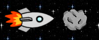

= Steckbrief der Methode *getOneIntersectingObject*

== Lernziel

Das konkrete Kollisionsobjekt abrufen und mit Typecast (Typumwandlung) gezielt weiterverarbeiten.

== Aus welcher Klasse stammt die Methode?

`Actor`

== Was macht die Methode?

Sie gibt ein Objekt zurück, mit dem sich das eigene Objekt überschneidet.

Für die Kollisionsprüfung wird der rechteckige Begrenzungsbereich (Bounding Box) eines Objekts verwendet. Überschneiden sich diese Bereiche, gilt das als Kollision.

== Wie sieht der Bauplan der Methode aus?

[source,java]
----
protected Actor getOneIntersectingObject(Class cls)
----

== Was bedeuten die einzelnen Wörter?

[cols="1,4",options="header"]
|===
|Begriff |Bedeutung

|`protected`
|Die Methode ist in der eigenen Klasse und in Unterklassen direkt aufrufbar; von außen (z. B. aus nicht verwandten Klassen) nicht.

|`Actor`
|Rückgabetyp: Die Methode liefert ein gefundenes Actor-Objekt zurück.

|`getOneIntersectingObject`
|Name der Methode.

|`Class`
|Als Parameter wird die Klasse der gesuchten Objekte erwartet.

|`cls`
|Name des Parameters mit der gesuchten Klasse.
|===

Hinweis

Eine Unterklasse von `Actor`, zum Beispiel ein `Raumschiff`, ist ein spezieller
`Actor`.

Wenn ein `Raumschiff` zurückgegeben werden soll, liefert die Methode zunächst
einen `Actor`. Deshalb muss anschließend angegeben werden, dass dieser `Actor`
als `Raumschiff` behandelt werden soll.

Das erfolgt mit einem Typecast (Typumwandlung). Dazu schreibt man in runden Klammern vor `getOneIntersectingObject(...)` den gewünschten Zieltyp.

Zusatz: Wird anstelle eines Klassennamens `null` übergeben, wird nach allen
Objekten gesucht.

Wichtig: Falls kein passendes Objekt gefunden wird, liefert die Methode `null`
zurück. Vor der weiteren Verwendung sollte deshalb eine Null-Prüfung erfolgen,
um Fehler zu vermeiden.

[source,java]
----
public void act() {
  move(1);
  if (isTouching(Asteroid.class)) {
    Actor obj = getOneIntersectingObject(null);
    if (obj != null) {
      // Ein oder mehre Objekte berühren das Raumschiff.
      obj.move(5);
    }
  }
}
----

[source,java]
----
public void act() {
  move(1);
  if (isTouching(Asteroid.class)) {
    Actor obj = getOneIntersectingObject(null);
    if (obj instanceof Asteroid) {
      Asteroid asteroid = (Asteroid) obj;
      asteroid.move(10);
    }
  }
}
----

Im folgenden Beispiel wird bei der Berührung des Raumschiffs mit dem Asteroiden
der Asteroid nach vorne bewegt.

[source,java]
----
import greenfoot.*;

public class Raumschiff extends Actor {
  /**
  * Attribute
  */

  /**
  * Konstruktor
  */
  public Raumschiff() {
  }

  public void act() {
    move(1);

    if (isTouching(Asteroid.class)) {
      Asteroid asteroid = (Asteroid) getOneIntersectingObject(Asteroid.class);
      asteroid.move(10);
    }
  }
}

----

Wichtig!

Die Methode _getOneIntersectingObject_ ermöglicht es, das Objekt, das sich mit dem eigenen Objekt überschneidet, in einer Variablen zu speichern. Danach können die
Methoden des gespeicherten Objekts aufgerufen werden.

Obwohl sich der Code in der Klasse Raumschiff befindet, kann in diesem
Beispiel die Methode _move_ des Asteroiden aufgerufen werden.

== Übungsaufgaben

1. Hole bei einer Kollision das konkrete Objekt und ändere dessen Verhalten.
2. Nutze einen Typecast für ein anderes eigenes Objekt.
3. Baue eine Null-Prüfung ein, bevor du auf das Objekt zugreifst.

== Checkliste: Kann ich jetzt ...?

- [ ] `getOneIntersectingObject(...)` korrekt einsetzen?
- [ ] erklären, warum ein Typecast nötig sein kann?
- [ ] eine sichere Verarbeitung mit Null-Prüfung schreiben?